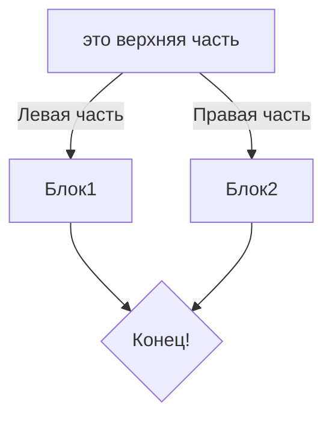

#### Это самая простая информация о GIT.
---
GIT - это система контроля версий. Она позволяет сохранять и использовать историю изменений текстовых файлов.

Как я понимаю, используют её в основном в IT-сфере.

Статусы файлов:
untracked
staged
modified
tracked

untracked -это файл, изменения которого git не отслеживает.

staged - этот статус файл получает после команды git add <file>. Означает, что состояние файла зафиксировано, и подготовлено к тому, чтобы сделать коммит. Этот файл также становится tracked.

